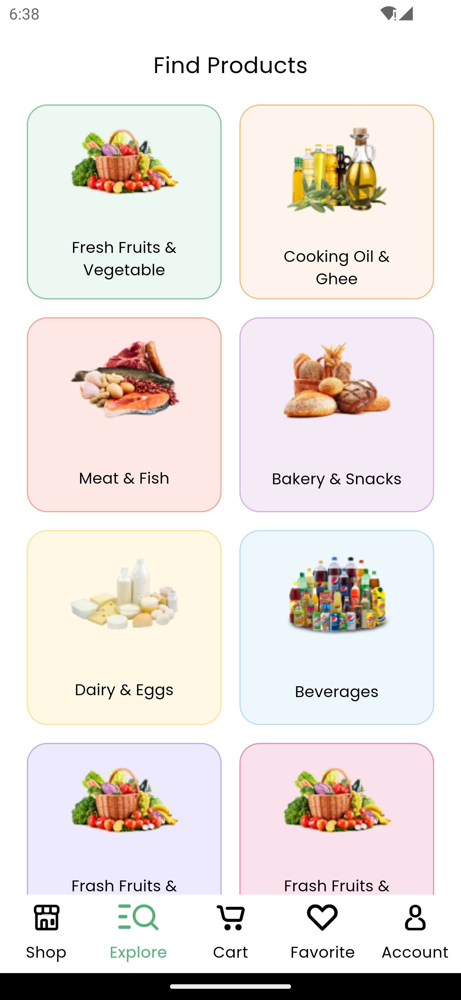
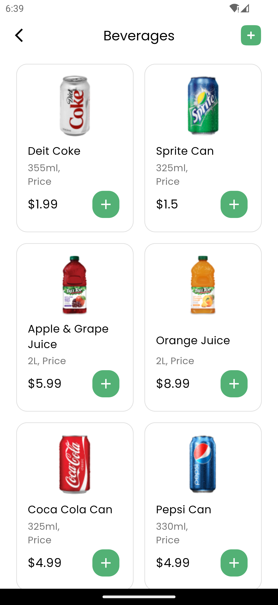
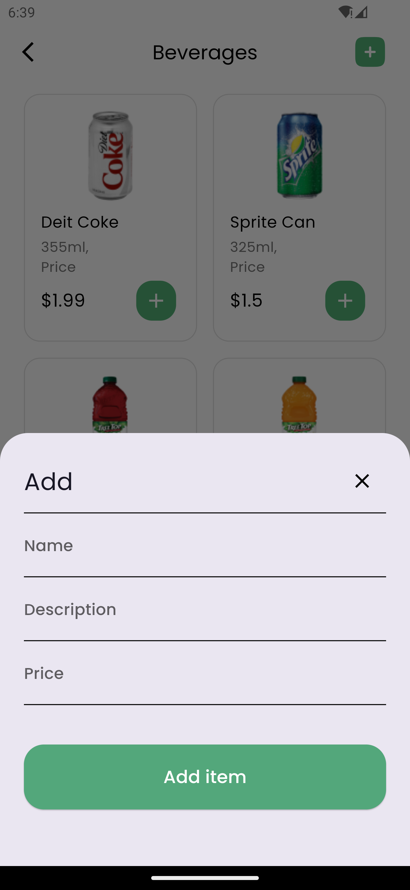
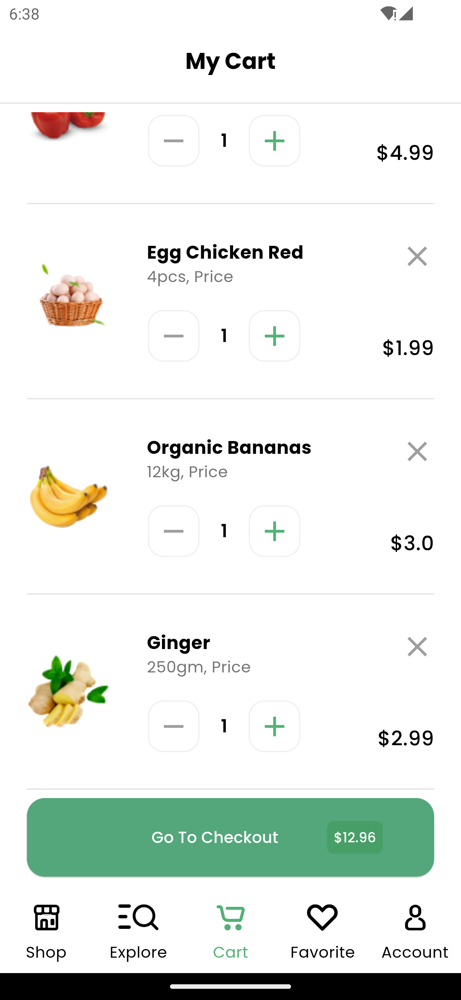
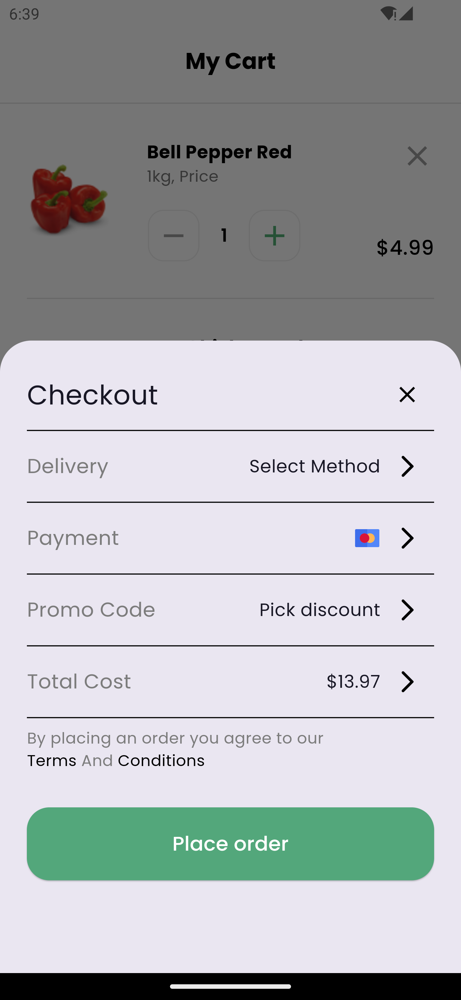
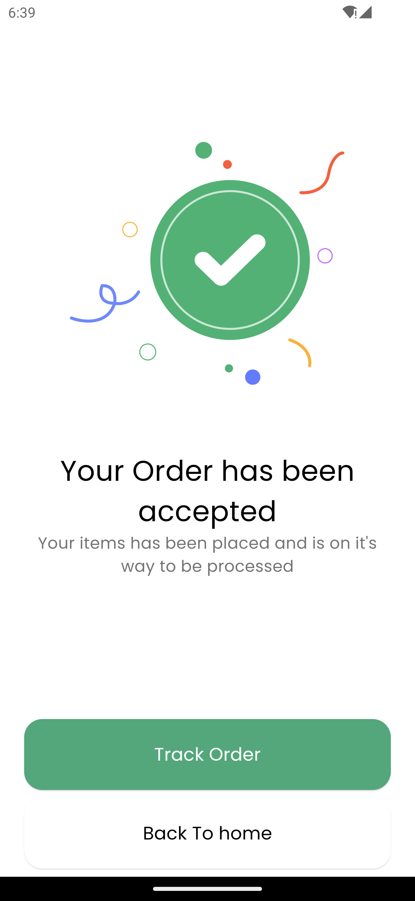

# Nectar

## Online Grocery Store App

### This is an awesome task. For training in Flutter framework

Welcome to the Nectar Online Grocery App repository! Our app offers a convenient and user-friendly
interface for online grocery shopping, enabling users to order groceries and receive deliveries in
as little as one hour.

## Table of Contents

- [Screenshots](#screenshots)
- [Installation](#installation)
- [Usage](#usage)
- [License](#license)

## Screenshots

<div style="display: flex; flex-wrap: wrap; gap: 50px;">














</div>

## Installation

To get a local copy of the app up and running, follow these simple steps.

### Prerequisites

- [Flutter](https://flutter.dev) installed on your local machine.
- A code editor like [Android Studio](https://developer.android.com/studio)
  or [Visual Studio Code](https://code.visualstudio.com/).

### Steps

1. **Clone the repository**:
    ```sh
    git clone https://github.com/Ahmad-Nour-Haidar/nectar-app-task.git
    ```

2. **Navigate to the project directory**:
    ```sh
    cd nectar-app-task
    ```

3. **Install the dependencies**:
    ```sh
    flutter pub get
    ```

4. **Run the app**:
    ```sh
    flutter run
    ```

## Usage

- **Explore Products**: Browse products by categories from the home screen.
- **Add to Cart**: Select products and add them to your cart.
- **Manage Cart**: Adjust quantities or remove items from your cart.
- **Checkout**: Proceed to checkout by selecting delivery and payment methods.
- **Track Order**: After placing an order, track its status from the order confirmation screen.

## License

Distributed under the MIT License. See `LICENSE` for more information.